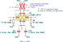

# 16-channel-jfet-pcb
16 Channel JFET Board 6-layer PCB designed with KiCAD 9.0 used for Skipper II project at NOIRLab.

This design uses LSJ689 P-JFET in common-drain or source follower configuration.

Designed by Braulio Cancino - braulio.cancino@noirlab.edu